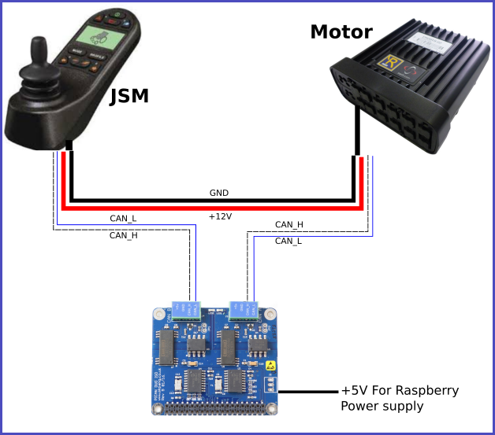

MHK: control wheelchair hack based on the can2RNET project 
===========================================================
- This hack exploit is part of "the Magic Joystick" project led by a french solidarity association: MyHumanKit - https://myhumankit.org/ 
- It occured during the Fabrikarium hackaton held in Mureaux, october 2019, with collaboration of MyHumanKit & ArianeGroup.
- Big Thanks to the 'can2RNET' creators (Stephen Chavez & Specter) and their contributors to have documented and shared their hack exploit !

Please refer to :
https://wikilab.myhumankit.org/index.php?title=Projets:Magic_Joystick_2020 for a complete documentation of the project.

  

**WARNING - EXPERIMENTAL BRANCH** 

This branch is for experimental developpements with piCanDual board.

The pusrpose of using a piCanDual board is to be able to record the JSM / Motor initialization sequence and then replace completely the JSM by the raspberry.

Current software version implements the following functionalities:

    * JSM init sequence recording
    * Rnet server, replacing JSM init and listening for Joystick client to connect (IP of the rspberry, default port 4141)
    * A Joy client that simulates Joystick using computer keyboard's arrows

  

1- Hardware setup
=================

  

2- Software setup:
==================

2.1- Raspberry configuration:
=============================
You will need to configure the raspberry to access internet for packages update and installation.
You also need to connect your rasberry to your computer through TCP (either Wifi or wired link) for the Joystick simulation

2.2- Software installation:
=============================

1- install git

2- get MagicJoystick2020 code

3- install all required software and configure raspberry system

<code>
sudo apt-get update

sudo apt-get install git

git clone https://github.com/myhumankit/MagicJoystick2020

cd MagicJoystick2020

sudo ./setup.sh
</code> 

2.3- Run Software:
==================

First, Record JSM init sequence:

* Check that JSM is powered OFF
* inside MagicJoystick2020/RnetCtrl folder type **"python3 RnetCtrlInit.py"**
* Power on the JSM
* Wait for the program to complete with following message: **"Initialisation sequence acquisition complete !"**
* Power off the JSM

 

Now the raspberry is ready to take the place of the JSM:

* inside MagicJoystick2020/RnetCtrl folder type **"python3 RnetCtrl.py"**

 

Now the raspberry is connected to the motor and waits for a Joystick client to connect on 0.0.0.0:4141

* On your PC, in a terminal (in the MagicJoystick2020/RnetCtrl folder) type the command **"python3 joyClient.py --ip 192.168.0.123"** (assuming your raspberry IP is 192.168.0.123)
* Then play with the arrows of your keyboard, the wheelchair should move... 
* Press any other key to stop it

 
**NOTE**

* The motor maximum speed is hard coded for the moment to a very slow speed.
* For each program, you can have a help display typing "python3 joyClient.py --help" for example.
